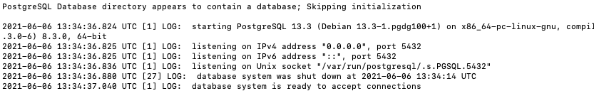

# Small poc to test db-replication in postgres 13 

You'll need docker and postgress setup on your local

Run the below command to create your master and standy postgres instances

```
docker run --name <name> -p 5432:5432 -v /<path_to_your_repo>/<name_of_instance>:/var/lib/postgresql/data -e POSTGRES_PASSWORD=postgres -d postgres
```

After this take a backup of your standby and copy master to standby, first stop the docker instances and then restart
example code
```
docker stop pgmaster pgstandby
mv pg_standby_data pg_standby_data_bk
cp -R data pg_standby_data
docker start pgmaster pgstandby
```

Once these are done, you'll need to update the postgresql.conf files in your master and standby intance folders and application_name in standy instance

Lastly add a standby.signal file in your master instance and restart both the docker containers

check docker logs with the below command
```
docker log <instance name>
```
for example if you check the standy logs, you'll see the below stating db is accepting connections



run the below command for both your master and standby replicas running on docker and replace the name
docker exec -it <name> psql -U postgres

then execute the below query 
```
select * from pg_stat_replication;
```

Now you should be able to play around with both master and standby dbs and check the replications happening correctly